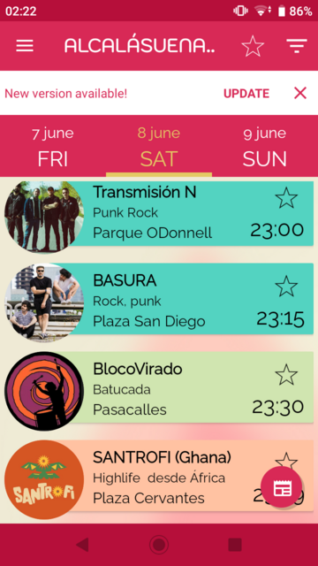
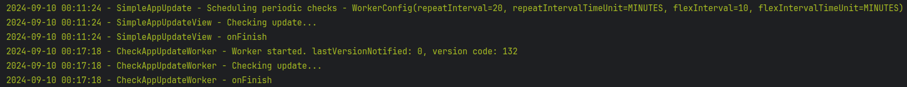

# SimpleAppUpdate

[](https://jitpack.io/#com.triskelapps/simpleappupdate)

**A very simple way to let Android users update your app.**

It is a wrapper of [In-App Updates Google Play library](https://developer.android.com/guide/playcore/in-app-updates) with extra features to notify users for new updates and install them in an integrated way without leaving the app.

### These are its main features:

- Custom View which displays automatically when an update is available. Just add it in your main activity layout!
- UPDATE button included to launch the integrated update process of [In-App Updates Google Play library](https://developer.android.com/guide/playcore/in-app-updates/kotlin-java)
- _Optional_ - Easy configuration of periodic Google Play updates checks. They run in background and displays a notification when an update is available.

---

### Getting started

-  Add the view to your main layout

```xml
<com.triskelapps.simpleappupdate.SimpleAppUpdateView
    android:layout_width="match_parent"
    android:layout_height="wrap_content" />
```

With just these lines, the user will see a view if there is an update available of your app in Google Play. It includes an Update button and Close icon to hide the view for this session:



- If you want to customize that view, there are some properties to set the background and foreground colors (text color and icon tint) and the text style (font size, typography, etc.):

```xml
    <com.triskelapps.simpleappupdate.SimpleAppUpdateView
        android:id="@+id/simple_app_update_view"
        android:layout_width="match_parent"
        android:layout_height="wrap_content"
        app:backgroundColor="@color/custom_background_color"
        app:foregroundColor="@color/custom_foreground_color"
        app:textStyle="@style/TextStyle" />
```

> [!TIP]
> To check the view style without waiting the next Google Play update, just get the view by its `id` and set visibility to [VISIBLE](https://developer.android.com/reference/android/view/View#VISIBLE "VISIBLE") programmatically

- If you need even more customization, you can implement your own view display process:

`Kotlin`
```kotlin
val simpleAppUpdate = SimpleAppUpdate(context)

simpleAppUpdate.setUpdateAvailableListener {
   // show any view with a "launch update button" which calls this method:
   // simpleAppUpdate.launchUpdate()
   }
}

// Optionally use these callbacks:
simpleAppUpdate.setErrorListener { }
simpleAppUpdate.setFinishListener { }

// Finally, launch check update process:
simpleAppUpdate.checkUpdateAvailable()
```

`Java`
```java
SimpleAppUpdate simpleAppUpdate = new SimpleAppUpdate(context);
simpleAppUpdate.setUpdateAvailableListener(() -> {
    onUpdateAvailable();  // show view with button to launch update throught: simpleAppUpdate.launchUpdate();
    return Unit.INSTANCE;  // Needed for Java-Kotlin interoperability
});
simpleAppUpdate.checkUpdateAvailable();
```
---

### Configure periodic updates checks

The previous view inside the app is useful when user open the application. If you also want to notify the user in the background with a system notification, configure it this way:

```kotlin
val notificationStyle = NotificationStyle(R.mipmap.your_app_icon, R.color.custom_notif_color)
val workerConfig = WorkerConfig()

SimpleAppUpdate.schedulePeriodicChecks(context, BuildConfig.VERSION_CODE, notificationStyle, workerConfig)
```

> [!NOTE]
> Inside checks scheduling, the library uses a [Unique Work](https://developer.android.com/develop/background-work/background-tasks/persistent/how-to/manage-work#unique-work) to ensure there is only one active work, so it is safe to call `SimpleAppUpdate.schedulePeriodicChecks(...)` more than once, for example inside  onCreate() method of Application class

- By default the checks periodicity is set to **8 hours (with 2 hours of flex interval)**. [See documentation](https://developer.android.com/develop/background-work/background-tasks/persistent/getting-started/define-work#flexible_run_intervals) for more info.
If you want to set your own period, just add the parameters when building `WorkerConfig`:
```kotlin
val workerConfig = WorkerConfig(2, TimeUnit.HOURS, 30, TimeUnit.MINUTES)
```

- To cancel an active check update worker call:
```kotlin
simpleAppUpdate.cancelWork()
```

- To check the work status, you can access the [WorkInfo](https://developer.android.com/reference/androidx/work/WorkInfo) data:
```kotlin
val workInfo = simpleAppUpdate.getWorkInfo()
```
For example you can check the enqueued state or the next schedule time


---

### Debugging
Debug the periodic check process is tricky as we would need to wait until the next process is triggered after the period.
To make it easy, the library saves some logs, so you can leave the app for some time and then access the logs calling:
```kotlin
val logs: String = simpleAppUpdate.getLogs()
```


> [!NOTE]
> The log has a maximum size of 100 entries

